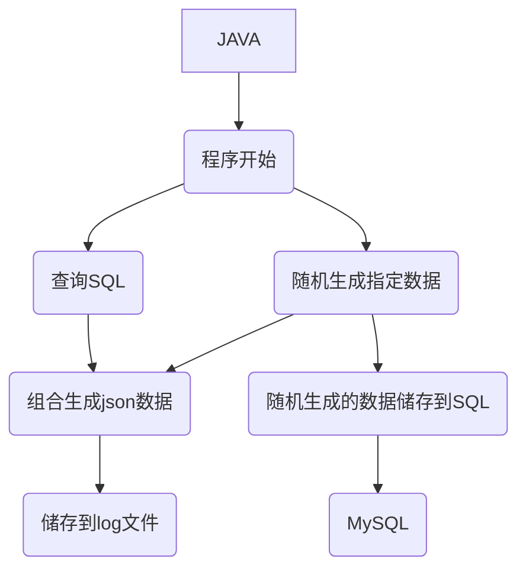

# 现阶段数据自动生成需求

数据库创建表`users`、`goods`、`order_table`、`order_info`

users表结构

```sql
CREATE TABLE IF NOT EXISTS users (
    u_id INT PRIMARY KEY COMMENT '用户id(主键)',
    username VARCHAR(255) NOT NULL UNIQUE COMMENT '用户名' 
) COMMENT = '用户表';
```

goods表结构

```sql
CREATE TABLE IF NOT EXISTS goods (
	g_id int(11) PRIMARY KEY COMMENT '商品id(主键)',
	goods_name VARCHAR(20) NOT NULL UNIQUE COMMENT '商品名字',
	goods_type VARCHAR(5) NOT NULL COMMENT '商品类型',
	goods_price DOUBLE NOT NULL COMMENT '商品单价'
) COMMENT = '商品表';
```

order_table表结构

```sql
CREATE TABLE IF NOT EXISTS order_table (
    o_id bigint AUTO_INCREMENT PRIMARY KEY COMMENT '订单ID',
    create_time date NOT NULL COMMENT '订单生成时间',
    u_id INT NOT NULL COMMENT '用户ID',
    FOREIGN KEY (u_id) REFERENCES users(u_id)
) COMMENT='订单表';
```

order_info表结构

```sql
CREATE TABLE IF NOT EXISTS order_info (
    id INT AUTO_INCREMENT PRIMARY KEY COMMENT '自增主键',
    o_id INT NOT NULL COMMENT '订单ID',
    g_id INT NOT NULL COMMENT '商品ID',
    num INT NOT NULL COMMENT '商品购买数量',
    FOREIGN KEY (o_id) REFERENCES order_table(o_id),
    FOREIGN KEY (g_id) REFERENCES goods(g_id)
) COMMENT='订单信息表';
```




