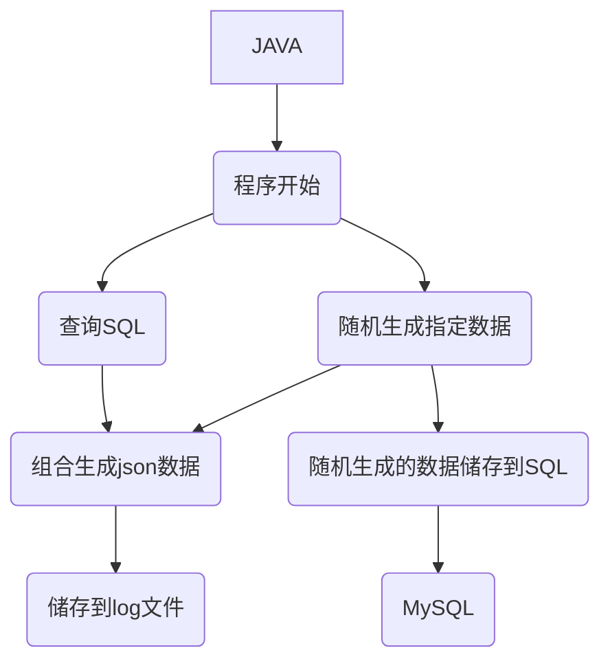

# 现阶段数据自动生成需求

数据库创建表`users`、`goods`、`order_table`、`order_info`

users表结构：

```sql
CREATE TABLE IF NOT EXISTS users (
    u_id INT PRIMARY KEY COMMENT '用户id(主键)',
    username VARCHAR(255) NOT NULL UNIQUE COMMENT '用户名',
    gender VARCHAR(2) NOT NULL COMMENT '性别',
    age INT NOT NULL COMMENT '年龄'
) COMMENT = '用户表';
```

goods表结构：

```sql
CREATE TABLE IF NOT EXISTS goods (
	g_id int(11) PRIMARY KEY COMMENT '商品id(主键)',
	goods_name VARCHAR(20) NOT NULL UNIQUE COMMENT '商品名字',
	goods_type VARCHAR(5) NOT NULL COMMENT '商品类型',
	goods_price DOUBLE NOT NULL COMMENT '商品单价'
) COMMENT = '商品表';
```

order_table表结构：

```sql
CREATE TABLE IF NOT EXISTS order_table (
    o_id bigint PRIMARY KEY COMMENT '订单ID',
    create_time date NOT NULL COMMENT '订单生成时间',
    u_id INT NOT NULL COMMENT '用户ID',
    FOREIGN KEY (u_id) REFERENCES users(u_id)
) COMMENT='订单表';
```

order_info表结构：

```sql
CREATE TABLE IF NOT EXISTS order_info (
    id INT AUTO_INCREMENT PRIMARY KEY COMMENT '自增主键',
    o_id BIGINT NOT NULL COMMENT '订单ID',
    g_id INT NOT NULL COMMENT '商品ID',
    num INT NOT NULL COMMENT '商品购买数量',
    FOREIGN KEY (o_id) REFERENCES order_table(o_id),
    FOREIGN KEY (g_id) REFERENCES goods(g_id)
) COMMENT='订单信息表';
```

程序运行所依赖数据：

```sql
INSERT INTO users (u_id, username, gender, age) VALUES
(1, 'Alice', '女', 25),
(2, 'Bob', '男', 30),
(3, 'Charlie', '男', 35),
(4, 'Diana', '女', 28),
(5, 'Eve', '女', 22),
(6, 'Frank', '男', 40),
(7, 'Grace', '女', 23),
(8, 'Hannah', '女', 29),
(9, 'Ian', '男', 32),
(10, 'Julia', '女', 21),
(11, 'Kevin', '男', 27),
(12, 'Laura', '女', 34),
(13, 'Mike', '男', 29),
(14, 'Nina', '女', 45),
(15, 'Oscar', '男', 26),
(16, 'Paula', '女', 22),
(17, 'Quentin', '男', 31),
(18, 'Rachel', '女', 33),
(19, 'Sam', '男', 42),
(20, 'Tina', '女', 29),
(21, 'Uma', '女', 25),
(22, 'Victor', '男', 37),
(23, 'Wendy', '女', 21),
(24, 'Xander', '男', 28),
(25, 'Yvonne', '女', 40),
(26, 'Zack', '男', 30),
(27, 'Ava', '女', 22),
(28, 'Ben', '男', 35),
(29, 'Cathy', '女', 28),
(30, 'Dan', '男', 45);

INSERT INTO goods (g_id, goods_name, goods_type, goods_price) VALUES
(1001, '可口可乐', '饮料', 3.00),
(1002, '百事可乐', '饮料', 3.00),
(1003, '芬达', '饮料', 3.00),
(1004, '老婆饼', '方便食品', 3.90),
(1005, '统一老坛酸菜牛肉面', '方便食品', 5.00),
(1006, '苹果', '水果蔬菜', 8.50),
(1007, '香蕉', '水果蔬菜', 12.60),
(1008, '奥利奥夹心饼干(草莓味)', '方便食品', 8.90),
(1009, '三全汤圆', '速冻食品', 16.90),
(1010, '思念水饺', '速冻食品', 28.90),
(1011, '牛奶', '饮料', 5.00),
(1012, '心相印纸巾', '清洁纸品', 6.90),
(1013, '纸尿裤', '清洁纸品', 12.80);
```

流程图：



